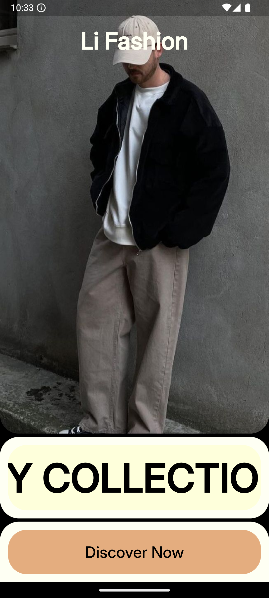
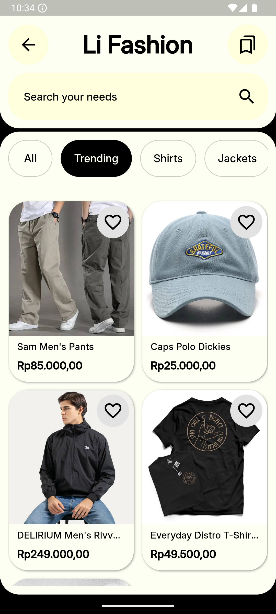
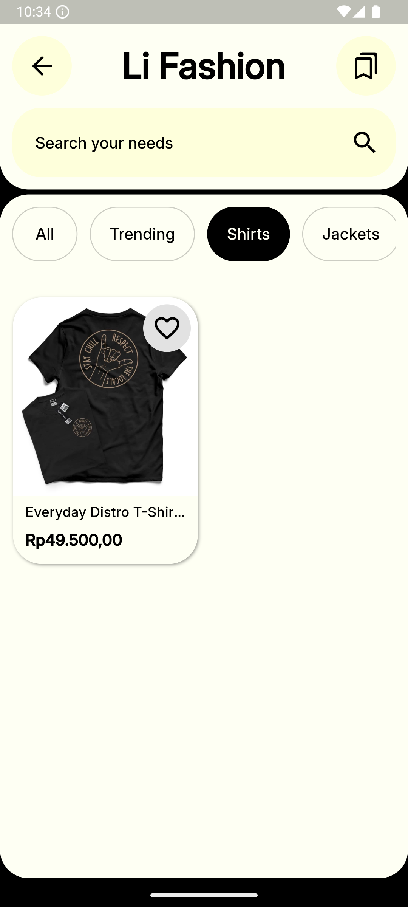
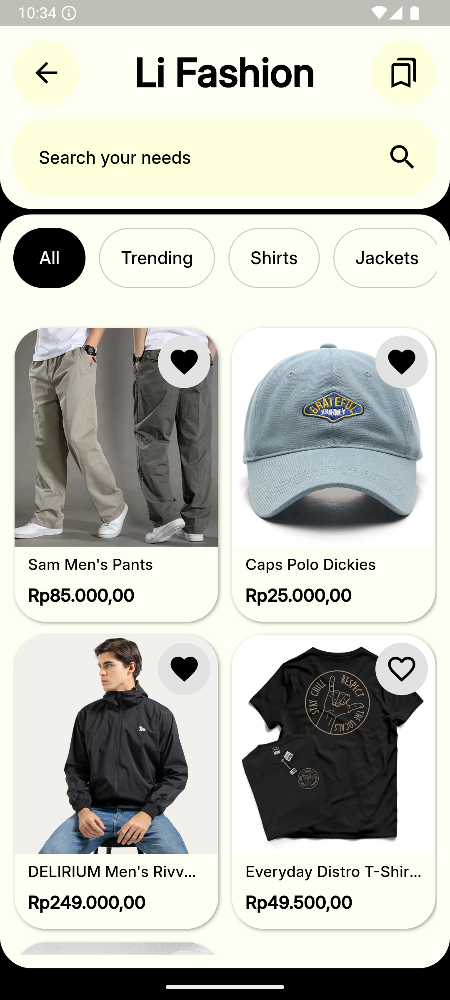
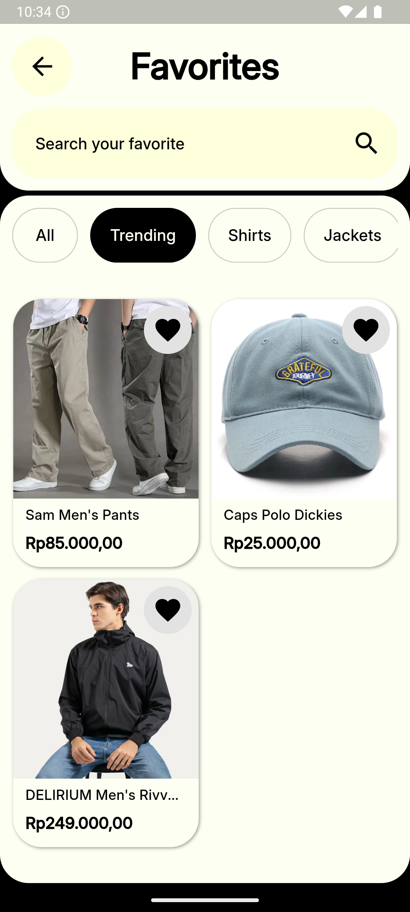
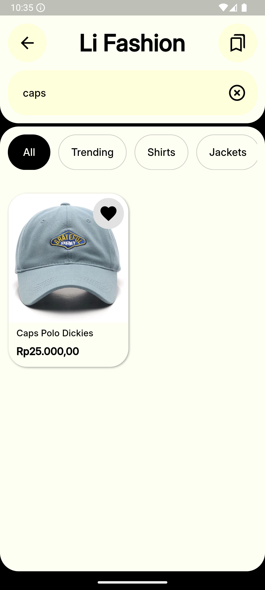
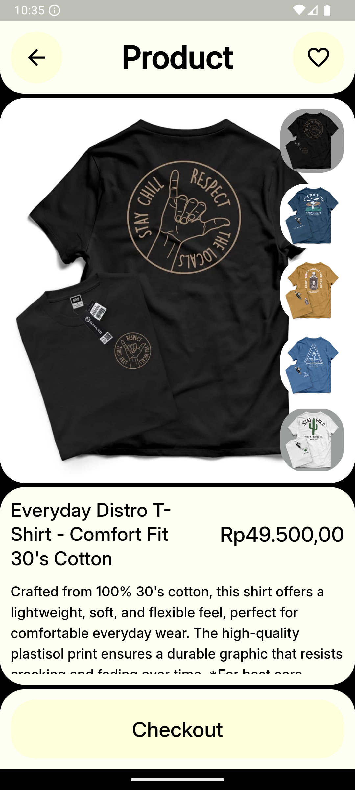

# li_fashion

- Built Multiplatform app with flutter, specified in mobile.
- Using API integration using google sheets api.
- Implementation of environment file in project.
- Implementation of redirect button to another app.
- Creating responsive ui layout.
- Implementation ui from figma to project.

## Inspired By Muhammad Shofiuddoula

[inspired design](https://dribbble.com/shots/24747396-Lumi-re-Fashion-mobile-app)

## Screenshot

